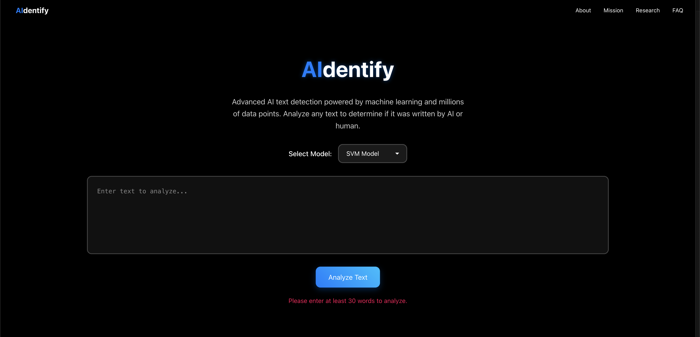

# AIdentify

A modern web application that utilizes research-backed machine learning to simplify AI writing detection. Built with React and powered by a custom-trained SVM and XGBoost model, and connected through a Flask-powered REST API.

Final product can be accessed here: https://rococo-meringue-48e238.netlify.app/

## Directory Details

**/ai_detector:** Frontend for website based on React and Emotion

**/api:** Source code for Flask-powered REST API utilized to connect responses from our custom-trained SVM (Support Vector Machine) and XGBoost Models 
  - Built off dataset of lexical features researched to be key components in distinguishing human and AI writing 
    - Verb ratio, Homonym/Synonym frequency, Burstiness, etc

